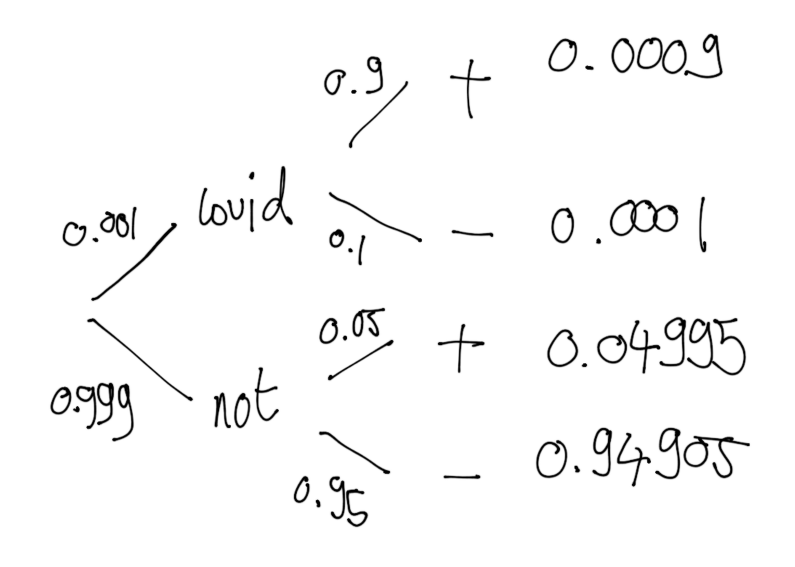

```{r setup, include = FALSE}
knitr::opts_chunk$set(cache = TRUE, 
                      echo = TRUE, 
                      message = FALSE, 
                      warning = FALSE,
                      fig.height=6, 
                      fig.width = 1.777777*6,
                      tidy = FALSE, 
                      comment = NA, 
                      highlight = TRUE, 
                      prompt = FALSE, 
                      crop = TRUE,
                      comment = "#>",
                      collapse = TRUE)
knitr::opts_knit$set(width = 60)
library(tidyverse)
library(reshape2)
theme_set(theme_light(base_size = 16))
make_latex_decorator <- function(output, otherwise) {
  function() {
      if (knitr:::is_latex_output()) output else otherwise
  }
}
insert_pause <- make_latex_decorator(". . .", "\n")
insert_slide_break <- make_latex_decorator("----", "\n")
insert_inc_bullet <- make_latex_decorator("> *", "*")
insert_html_math <- make_latex_decorator("", "$$")
```

## Credit where credit's due

* Ruth King, Byron Morgan, Steve Brooks (our workshops and [\alert{Bayesian analysis for population ecology} book](https://www.maths.ed.ac.uk/~rking33/Book-website/index.html)).

* Richard McElreath ([\alert{Statistical rethinking} book and lecture videos](https://github.com/rmcelreath/statrethinking_winter2019)).

* Jim Albert and Jingchen Hu ([\alert{Probability and Bayesian modelling} book](https://bayesball.github.io/BOOK/probability-a-measurement-of-uncertainty.html)).

* Materials shared by [\alert{Tristan Marh}](https://www.tjmahr.com/), [\alert{Jason Matthiopoulos}](https://www.gla.ac.uk/researchinstitutes/bahcm/staff/jasonmatthiopoulos/), [\alert{Francisco Rodriguez Sanchez}](https://frodriguezsanchez.net/), [\alert{Kerrie Mengersen}](https://staff.qut.edu.au/staff/k.mengersen) and [\alert{Mark Lai}](https://quantscience.rbind.io/).

## Slides codes and data

* All material prepared with `R`.
* `R Markdown` used to write reproducible material.
* Slides available on FigShare [\alert{here}](https://doi.org/10.6084/m9.figshare.12656894.v1).
* Material available on Github [\alert{there}](https://github.com/oliviergimenez/Bayesian_Workshop).

## Objectives

* Try and demystify Bayesian statistics, and what we call MCMC.
* Make the difference between Bayesian and Frequentist analyses.
* Understand the Methods section of ecological papers doing Bayesian stuff.
* Run Bayesian analyses, safely hopefully.

`r insert_slide_break()`

```{r, out.width = '13cm',out.height='7cm',fig.align='center',echo=FALSE}
knitr::include_graphics('img/brace_yourself.jpeg')
```

## What is on our plate?

1. Bayesian inference: Motivation and examples. 
2. The likelihood. 
3. A detour to explore priors.
4. Markov chains Monte Carlo methods (MCMC).
5. Bayesian analyses in R with the Jags software.
6. Contrast ecological hypotheses with model selection. 
7. Heterogeneity and multilevel models (aka mixed models).

# I want moooooore

`r insert_slide_break()`

```{r, out.width = '13cm',out.height='7cm',fig.align='center',echo=FALSE}
knitr::include_graphics('img/books.jpeg')
```

`r insert_slide_break()`

```{r, fig.align = 'center', echo = FALSE}
knitr::include_graphics('img/mccarthy.png')
```

`r insert_slide_break()`

```{r, fig.align = 'center', echo = FALSE}
knitr::include_graphics('img/kery.png')
```

`r insert_slide_break()`

```{r, fig.align = 'center', echo = FALSE}
knitr::include_graphics('img/kruschke.png')
```

`r insert_slide_break()`

```{r, fig.align = 'center', echo = FALSE}
knitr::include_graphics('img/mcelreath.png')
```

`r insert_slide_break()`

```{r, fig.align = 'center', echo = FALSE}
knitr::include_graphics('img/gelmanhill.png')
```


# What is Bayesian inference?

`r insert_slide_break()`


## A reminder on conditional probabilities

`r insert_inc_bullet()` $\Pr(A \mid B)$: Probability of A given B

`r insert_inc_bullet()` The ordering matters: $\Pr(A \mid B)$ is not the same as $\Pr(B \mid A)$.

`r insert_inc_bullet()` $\Pr(A \mid B) = \displaystyle{\frac{\Pr(A \text{ and } B)}{\Pr(B)}}$

`r insert_slide_break()`


## Screening for vampirism

`r insert_inc_bullet()` The chance of the  test being positive given you are a vampire is $\Pr(+|\text{vampire}) = 0.90$ (**sensitivity**).

`r insert_inc_bullet()` The chance of a negative test given you are mortal is $\Pr(-|\text{mortal}) = 0.95$ (**specificity**).


## What is the question?

`r insert_inc_bullet()` From the perspective of the test: Given a person is a vampire, what is the probability that the test is positive? $\Pr(+|\text{vampire}) = 0.90$.

`r insert_inc_bullet()` From the perspective of a person: Given that the test is positive, what is the probability that this person is a vampire? $\Pr(\text{vampire}|+) = \; ?$

`r insert_inc_bullet()` Assume that vampires are rare, and represent only $0.1\%$ of the population. This means that $\Pr(\text{vampire}) = 0.001$.

## What is the answer? Bayes' theorem to the rescue!

\begincols
\begincol



\endcol

\begincol

- $\Pr(\text{vampire}|+) = \displaystyle{\frac{\Pr(\text{vampire and } +)}{\Pr(+)}}$

`r insert_pause()`

- $\Pr(\text{vampire and } +) = \Pr(\text{vampire}) \; \Pr(+ | \text{vampire}) = 0.0009$

`r insert_pause()`

- $\Pr(+) = 0.0009 + 0.04995 = 0.05085$

`r insert_pause()`

- $\Pr(\text{vampire}|+) = 0.0009/0.05085 = 0.02$

\endcol
\endcols

`r insert_pause()`

$$\Pr(\text{vampire}|+)= \displaystyle{\frac{ \Pr(+|\text{vampire}) \; \Pr(\text{vampire})}{\Pr(+)}}$$

# Your turn

## Screening for vampirism

* Suppose the diagnostic test has the same sensitivity and specificity but vampirism is more common: $10\%$ of the population is vampire. 

* What is the probability that a person is a vampire, given that the test is positive?

# Solution

## The probability that a person is a vampire, given that the test is positive

- $\Pr(+ | \text{vampire}) = 0.9$
- $\Pr(- | \text{mortal}) = 0.95$
- $\Pr(\text{vampire}) = 0.1$

$$\begin{aligned}
 \Pr(+) &= \Pr(+ | \text{vampire}) \Pr(\text{vampire}) + \Pr(+ | \text{mortal}) \Pr(\text{mortal}) \\
  &= 0.9*0.1 + 0.05*0.9 \\
  &=0.135
\end{aligned}
$$

$$\begin{aligned}
 \Pr(\text{vampire} | +) &= \Pr(+ | \text{vampire}) \Pr(\text{vampire}) / \Pr(+) \\
  &= 0.9*0.1 / 0.135
\end{aligned}
$$

## Bayes' theorem

\begincols
\begincol

* A theorem about conditional probabilities.

* $\Pr(B \mid A) = \displaystyle{\frac{ \Pr(A \mid B) \; \Pr(B)}{\Pr(A)}}$

\endcol

\begincol


\endcol
\endcols

## Bayes' theorem

`r insert_inc_bullet()` Easy to mess up with letters. Might be easier to remember when written like this:

$$ \Pr(\text{hypothesis} \mid \text{data}) = \frac{ \Pr(\text{data} \mid \text{hypothesis}) \; \Pr(\text{hypothesis})}{\Pr(\text{data})} $$

`r insert_inc_bullet()` The "hypothesis" is typically something unobserved or unknown. It's what you want to learn about using the data. 

`r insert_inc_bullet()` For regression models, the "hypothesis" is a parameter (intercept, slopes or error terms).

`r insert_inc_bullet()` Bayes theorem tells you the probability of the hypothesis given the data.


## What is doing science after all?

How plausible is some hypothesis given the data?

$$ \Pr(\text{hypothesis} \mid \text{data}) = \frac{ \Pr(\text{data} \mid \text{hypothesis}) \; \Pr(\text{hypothesis})}{\Pr(\text{data})} $$

## Why is Bayesian statistics not the default?

`r insert_inc_bullet()` Due to practical problems of implementing the Bayesian approach, and some wars of male statisticians's egos, little advance was made for over two centuries.

`r insert_inc_bullet()` Recent advances in computational power coupled with the development of new methodology have led to a great increase in the application of Bayesian methods within the last two decades.


## Frequentist versus Bayesian	

`r insert_inc_bullet()` Typical stats problems involve estimating parameter $\theta$ with available data.

`r insert_inc_bullet()` The frequentist approach (**maximum likelihood estimation** – MLE) assumes that the parameters are fixed, but have unknown values to be estimated.

`r insert_inc_bullet()` Classical estimates generally provide a point estimate of the parameter of interest.

`r insert_inc_bullet()` The Bayesian approach assumes that the parameters are not fixed but have some fixed  unknown distribution - a distribution for the parameter.


## What is the Bayesian approach?	

* The approach is based upon the idea that the experimenter begins with some prior beliefs about the system.

`r insert_pause()`

* And then updates these beliefs on the basis of observed data.

`r insert_pause()`

* This updating procedure is based upon the Bayes’ Theorem:

$$\Pr(A \mid B) = \frac{\Pr(B \mid A) \; \Pr(A)}{\Pr(B)}$$

## What is the Bayesian approach?	

* Schematically if $A = \theta$ and $B = \text{data}$, then

`r insert_pause()`

* The Bayes' theorem

$$\Pr(A \mid B) = \frac{\Pr(B \mid A) \; \Pr(A)}{\Pr(B)}$$

`r insert_pause()`

* Translates into:

$$\Pr(\theta \mid \text{data}) = \frac{\Pr(\text{data} \mid \theta) \; \Pr(\theta)}{\Pr(\text{data})}$$

## Bayes' theorem	

$${\color{red}{\Pr(\theta \mid \text{data})}} = \frac{\color{blue}{\Pr(\text{data} \mid \theta)} \; \color{green}{\Pr(\theta)}}{\color{orange}{\Pr(\text{data})}}$$

`r insert_pause()`

* \textcolor{red}{Posterior distribution}: Represents what you know after having seen the data. The basis for inference, a distribution, possibly multivariate if more than one parameter ($\theta$). 

`r insert_pause()`

* \textcolor{blue}{Likelihood}: We know that guy from before, same as in the MLE approach.

`r insert_pause()`

* \textcolor{green}{Prior distribution}: Represents what you know before seeing the data. The source of much discussion about the Bayesian approach.

`r insert_pause()`

* $\color{orange}{\Pr(\text{data}) = \int L(\text{data} \mid \theta) \;\Pr(\theta) d\theta }$: Possibly high-dimensional integral, difficult if not impossible to calculate. This is one of the reasons why we need simulation (MCMC) methods - more soon.

`r insert_slide_break()`

```{r, echo=FALSE, fig.align='center'}
knitr::include_graphics('img/frequentists_vs_bayesians_2x.png')
```


# Likelihood

## Context

`r insert_inc_bullet()` Usually, when talking about probability distributions, we assume that we know the parameter values.

`r insert_inc_bullet()` In the real world, it is usually the other way around.

## A question of interest might be for example: 

> We have observed 3 births by a female during her 10 breeding
attempts. What does this tell us about the true probability of
getting a successful breeding attempt from this female? For the population?

`r insert_slide_break()`

* We don’t know what the probability of a birth is.

* But we can calculate the probability of getting our data for different values:

```{r,collapse=TRUE}
dbinom(x=3,size=10,prob=0.1)
```

`r insert_slide_break()`

* We don’t know what the probability of a birth is. 

* But we can see what the probability of getting our data would be for different values:

```{r,collapse=TRUE}
dbinom(x=3,size=10,prob=0.9)
```

`r insert_slide_break()`

* We don’t know what the probability of a birth is. 

* But we can see what the probability of getting our data would be for different values:

```{r,collapse=TRUE}
dbinom(x=3,size=10,prob=0.25)
```

`r insert_slide_break()`

```{r,collapse=TRUE}
dbinom(x=3,size=10,prob=0.1)
dbinom(x=3,size=10,prob=0.9)
dbinom(x=3,size=10,prob=0.25)
```

So we would be more likely to observe 3 births if the probability is 0.25 than 0.1 or 0.9.

## The likelihood

* This reasoning is so common in statistics that it has a special name:

`r insert_pause()`

* **The likelihood** is the probability of observing the data under a certain model.

`r insert_pause()`

* The data are known, we usually consider the likelihood as a function of the model parameters $\theta_1,\theta_2, \ldots, \theta_p$

$$L = P(\theta_1,\theta_2, \ldots, \theta_p \mid \text{data})$$

## Likelihood functions

We may create a function to calculate a likelihood:

```{r,collapse=TRUE}
lik.fun <- function(parameter){
  ll <- dbinom(x=3, size=10, prob=parameter)
  return(ll)
}

lik.fun(0.3)

lik.fun(0.6)
```

## Maximize the likelihood (3 successes ot of 10 attempts)

```{r, echo=FALSE}
lik.fun <- function(parameter){
  ll <- dbinom(x=3, size=10, prob=parameter)
  return(ll)
}
p.grid = seq(0,1,by=0.01)
lik = rep(NA,length(p.grid))
for (i in 1:length(p.grid)){
  lik[i] <- lik.fun(p.grid[i])
}
plot(p.grid,lik,xlab='Probability of getting a successful breeding',ylab='Likelihood',type='l',lwd=3,cex.lab=1.5)
abline(v=0.3,lty=2,lwd=2,col='blue')
```

The *maximum* of the likelihood is at value $0.3$

## Maximum likelihood estimation

* There is always a set of parameters that gives you the highest likelihood of observing the data, and this is the MLE.

`r insert_pause()`

* These can be calculated using:

     + Trial and error (not efficient!).
     + Compute the maximum of a function by hand (rarely doable in practice).
     + An iterative optimization algorithm: `?optim` in `R`.
     
## By hand: compute MLE of $p$ from $Y \sim \text{Bin}(N=10,p)$ with $k=3$ successes

`r insert_inc_bullet()` $P(Y=k) = {{k}\choose{N}} p^k (1-p)^{N-k} = L(p)$.

`r insert_inc_bullet()` $\log(L(p)) = \text{cte} + k \log(p) + (N-k) \log(1-p)$.

`r insert_inc_bullet()` We are searching for the maximum of $L$, or equivalently that of $\log(L)$.

`r insert_inc_bullet()` Compute derivate w.r.t. $p$: $\displaystyle{{{d\log(L)}\over{dp}} = {{k}\over{p}} - {{(N-k)}\over{(1-p)}}}$.

`r insert_inc_bullet()` Then solve $\displaystyle{{{d\log(L)}\over{dp}}=0}$; the MLE is $\displaystyle{\hat{p} = {{k}\over{N}}={{3}\over{10}}=0.3}$.

`r insert_inc_bullet()` Here, the MLE is the proportion of observed successes.

## Using a computer: MLE of $p$ from $Y \sim \text{Bin}(N=10,p)$ with $k=3$ successes

```{r,collapse=TRUE}
lik.fun <- function(parameter) dbinom(x=3, size=10, prob=parameter)
# ?optimize
optimize(lik.fun,c(0,1),maximum=TRUE)
```

Use `optim` when the number of parameters is $> 1$.

## Using a computer: MLE of $p$ from $Y \sim \text{Bin}(N=10,p)$ with $k=3$ successes

```{r, echo=FALSE}
lik.fun <- function(parameter) dbinom(x=3, size=10, prob=parameter)
plot(lik.fun,0,1,xlab="probability of success (p)",ylab="log-likelihood(p)",main="Binomial likelihood with 3 successes ot of 10 attempts",lwd=3,cex.lab=1.5, cex.axis=1.5, cex.main=1.5, cex.sub=1.5)
abline(v=0.3,h=0.26682,col='blue',lty=2,lwd=2)
```

# Your turn

## MLE of the parameters of a Normal distribution

* Assume we have collected data on the height of 100 people:
```{r}
# set seed for random numbers
set.seed(2020)
# simulate data from Normal distribution
n <- 100
height <- rnorm(n, mean=170, sd=10)
```

`r insert_slide_break()`

```{r echo=FALSE}
data.frame(height=height) %>%
  ggplot(aes(x=height))+ 
  geom_histogram(color="blue",fill="dodgerblue") + 
  labs(x = "Height", y = 'Density')
```

`r insert_slide_break()`

* We consider a Normal distribution for the model. 

* Compute the MLE of the parameters of the Normal distribution.

* Hint: Use functions `optim()` and `dnorm()`

# Solution

## `R` code 

* Write a function for the likelihood of a Normal distribution with parameters mean $\mu$ and standard deviation $\sigma$:
```{r}
negloglik <- function(theta, data) {
  mu <- theta[1]
  sigma <- theta[2]
  x <- data
  -sum(dnorm(x, mean = mu, sd = sigma, log = TRUE))
}
negloglik(theta = c(150,1), height)
```

`r insert_slide_break()`

* Minimiiiiiize
```{r}
fit <- optim(par = c(1,1), fn = negloglik, data = height)
fit
```

`r insert_slide_break()`

```{r, echo = FALSE}
binwidth <- 1 
df <- data.frame(x = height) %>%
  ggplot(aes(x = height, mean = fit$par[1], sd = fit$par[2], binwidth = binwidth, n = n)) +
  geom_histogram(binwidth = binwidth, 
                 colour = "white", 
                 fill = "cornflowerblue", 
                 size = 0.1) +
  stat_function(fun = function(x) dnorm(x, mean = fit$par[1], sd = fit$par[2]) * n * binwidth,
    color = "darkred", size = 1)
df
```


# Back to Bayes

## A simple example
* Let us take a simple example to fix ideas.
* 120 deer were radio-tracked over winter.
* 61 close to a plant, 59 far from any human activity.
* Question: is there a treatment effect on survival?

|            | Released   | Alive | Dead | Other |
|------------+----------+-------+------+-------| 
| treatment  | 61 | 19 | 38 | 4 |
| control    | 59 | 21 | 38 | 0 |


`r insert_slide_break()`

`r insert_inc_bullet()` So, $n = 57$ deer were assigned to the treatment group of which $k=19$ survived the winter.

`r insert_inc_bullet()` Of interest is the probability of over-winter survival, call it $\theta$, for the general population within the treatment area.

`r insert_inc_bullet()` The obvious estimate is simply to take the ratio $k/n=19/57$.


`r insert_inc_bullet()` How would the classical statistician justify this estimate?

`r insert_slide_break()`

* Our model is that we have a Binomial experiment (assuming independent and identically distributed draws from the population).

`r insert_pause()`

* $K$ the number of alive individuals at the end of the winter, so that $P(K=k) = \binom{n}{k}\theta^k(1-\theta)^{n-k}$.

`r insert_pause()`

* The classical approach is to maximise the corresponding likelihood with respect to $\theta$ to obtain the entirely plausible MLE:

$$ \hat{\theta} = k/n = 19/57$$.

## The Bayesian approach

`r insert_inc_bullet()` The Bayesian starts off with a prior.

`r insert_inc_bullet()` Now, the one thing we know about $\theta$ is that is a continuous random variable and that it lies between zero and one.

`r insert_inc_bullet()` Thus, a suitable prior distribution might be the Beta defined on $[0,1]$.

`r insert_inc_bullet()` What is the Beta distribution?

## What is the Beta distribution?

$$
q(\theta \mid \alpha, \beta) = \frac{1}{\text{Beta}(\alpha, \beta)}{\theta^{\alpha-1}} {(1-\theta)^{\theta-1}} 
$$

with $\text{Beta}(\alpha, \beta) = \displaystyle{\frac{\Gamma(\alpha)\Gamma(\beta)}{\Gamma(\alpha+\beta)}}$ and $\Gamma(n) = (n-1)!$

`r insert_slide_break()`

```{r, echo=FALSE} 
x <- seq(0, 1, length=200)
par(mfrow = c(2,3))
# distribution a posteriori beta
plot(x,dbeta(x, 1, 1),type='l',xlab='q',ylab='Density',main='beta(1,1)',lwd=3,col='red',ylim=c(0,1.5))
plot(x,dbeta(x, 2, 1),type='l',xlab='q',ylab='',main='beta(2,1)',lwd=3,col='red',ylim=c(0,2))
plot(x,dbeta(x, 1, 2),type='l',xlab='q',ylab='',main='beta(1,2)',lwd=3,col='red',ylim=c(0,2))
plot(x,dbeta(x, 2, 2),type='l',xlab='q',ylab='Density',main='beta(2,2)',lwd=3,col='red',ylim=c(0,1.5))
plot(x,dbeta(x, 10, 10),type='l',xlab='q',ylab='',main='beta(10,10)',lwd=3,col='red',ylim=c(0,3.5))
plot(x,dbeta(x, 0.8, 0.8),type='l',xlab='q',ylab='',main='beta(0.8,0.8)',lwd=3,col='red',ylim=c(0.5,2.5))
```

## The Bayesian approach

* We assume a priori that $\theta \sim Beta(a,b)$ so that $\Pr(\theta) = \theta^{a-1} (1 - \theta)^{b-1}$

`r insert_pause()`

* Then we have:

$$
\begin{aligned}
{\color{red}{Pr(\theta \mid k)}} & \propto {\color{blue}{\binom{n}{k}\theta^k(1-\theta)^{n-k}}} \; {\color{green}{\theta^{a-1} (1 - \theta)^{b-1}}}\\
& \propto {\theta^{(a+k)-1}} {(1-\theta)^{(b+n-k)-1}} 
\end{aligned}
$$

`r insert_pause()`

* That is: 

$$ \theta \mid k \sim Beta(a+k,b+n-k)$$

`r insert_pause()`

* Take a Beta prior with a Binomial likelihood, you get a Beta posterior (conjugacy)

## Application to the deer example

`r insert_inc_bullet()` Posterior distribution of survival is $\theta \sim Beta(a+k,b+n-k)$.

`r insert_inc_bullet()` If we take a Uniform prior, i.e. $Beta(1,1)$, then we have: 

`r insert_inc_bullet()` $\theta_{treatment} \sim Beta(1+19,1+57-19)=Beta(20,39)$

`r insert_inc_bullet()` Note that in this specific situation, the posterior has an explicit expression, easy to manipulate.

`r insert_inc_bullet()` In particular, $E(Beta(a,b)) = \displaystyle{\frac{a}{a+b}} = 20/59$ to be compared with the MLE $19/57$.

## A general result

**This is a general result, the Bayesian and frequentist estimates will always agree if there is sufficient data, so long as the likelihood is not explicitly ruled out by the prior.**

## Prior $Beta(1,1)$ and posterior survival $Beta(20,39)$
```{r echo=FALSE}
x <- seq(0, 1, length=200)
# distribution a posteriori beta
plot(x,dbeta(x, 20,39),type='l',xlab='',ylab='',main='',lwd=3,col='red')
# distribution a priori uniforme
points(x,dbeta(x, 1, 1),type='l',lwd=3)
```

## Prior $Beta(1,1)$ and posterior survival $Beta(20,39)$
```{r echo=FALSE}
x <- seq(0, 1, length=200)
# distribution a posteriori beta
plot(x,dbeta(x, 20,39),type='l',xlab='',ylab='',main='',lwd=3,col='red')
# distribution a priori uniforme
points(x,dbeta(x, 1, 1),type='l',lwd=3)
abline(v = 19/57, lwd = 3, lty = 2, col = 'blue')
text(x = 0.28, y = 0, 'MLE', col = 'blue')
```

## Notation

Our model so far
`r insert_html_math()`
\begin{align*}
   y &\sim \text{Binomial}(N, \theta) &\text{[likelihood]}
   \\
  \theta &\sim \text{Beta}(1, 1) &\text{[prior for }\theta \text{]} \\ 
\end{align*}
`r insert_html_math()`

`r insert_slide_break()`


# A detour to explore priors

# Influence of the prior

## Prior $Beta(0.5,0.5)$ and posterior survival $Beta(19.5,38.5)$
```{r echo=FALSE}
x <- seq(0, 1, length=200)
# distribution a posteriori beta
plot(x,dbeta(x, .5+19,.5+57-19),type='l',xlab='',ylab='',main='',lwd=3,col='red')
# distribution a priori uniforme
points(x,dbeta(x, .5, .5),type='l',lwd=3)
```

## Prior $Beta(2,2)$ and posterior survival $Beta(21,40)$
```{r echo=FALSE}
x <- seq(0, 1, length=200)
# distribution a posteriori beta
plot(x,dbeta(x, 2+19,2+57-19),type='l',xlab='',ylab='',main='',lwd=3,col='red')
# distribution a priori uniforme
points(x,dbeta(x, 2, 2),type='l',lwd=3)
```

## Prior $Beta(20,1)$ and posterior survival $Beta(39,49)$
```{r echo=FALSE}
x <- seq(0, 1, length=200)
# distribution a posteriori beta
plot(x,dbeta(x, 20+19,1+57-19),type='l',xlab='',ylab='',main='',lwd=3,col='red')
# distribution a priori uniforme
points(x,dbeta(x, 20, 1),type='l',lwd=3)
```

## The role of the prior

`r insert_inc_bullet()` In biological applications, the prior is a convenient means of incorporating expert opinion or information from previous or related studies that would otherwise need to be ignored. We'll get back to that.

`r insert_inc_bullet()` With sparse data, the role of the prior can be to enable inference on key parameters that would otherwise be impossible.

`r insert_inc_bullet()` With sufficiently large and informative datasets the prior typically has little effect on the results.

`r insert_inc_bullet()` Always perform a sensitivity analysis.

## Informative priors vs. no information

`r insert_inc_bullet()` Informative priors aim to reflect information available to the analyst that is gained independently of the data being studied.

`r insert_inc_bullet()` In the absence of any prior information on one or more model parameters we wish to ensure that this lack of knowledge is properly reflected in the prior.

`r insert_inc_bullet()` Always perform a sensitivity analysis. 

`r insert_slide_break()`

```{r, out.width = '11cm',out.height='7cm',fig.align='center',echo=FALSE}
knitr::include_graphics('img/falling_man.jpg')    
```

# How to incorporate prior information? 

## Estimating survival using capture-recapture data

* A bird might captured, missed and recaptured; this is coded $101$.

`r insert_pause()`

* Simplest model relies on constant survival $\phi$ and detection $p$ probabilities.

`r insert_pause()`

* Likelihood for that particular bird:

$$\Pr(101) = \phi (1-p) \phi p $$

`r insert_pause()`

* We assume a vague prior:

$$\phi_{prior} \sim \text{Beta}(1,1) = \text{Uniform}(0,1)$$

## Notation

* $y_{i,t} = 1$ if individual $i$ detected at occasion $t$ and $0$ otherwise
* $z_{i,t} = 1$ if individual $i$ alive between occasions $t$ and $t+1$ and $0$ otherwise

`r insert_html_math()`
\begin{align*}
   y_{i,t} \mid z_{i,t} &\sim \text{Bernoulli}(p \; z_{i,t}) &\text{[likelihood (observation eq.)]} \\
   z_{i,t+1} \mid z_{i,t}&\sim \text{Bernoulli}(\phi \; z_{i,t}) &\text{[likelihood (state eq.)]} \\
  \phi &\sim \text{Beta}(1, 1) &\text{[prior for }\phi \text{]} \\ 
  p &\sim \text{Beta}(1, 1) &\text{[prior for p]} \\ 
\end{align*}
`r insert_html_math()`


## European dippers in Eastern France (1981-1987)

```{r, out.width = '10cm',out.height='6cm',fig.align='center',echo=FALSE}
knitr::include_graphics('img/dipper.png')    
```

## How to incorporate prior information?

`r insert_inc_bullet()` If no information, mean posterior survival is $\phi_{posterior} = 0.56$ with credible interval $[0.51,0.61]$.

`r insert_inc_bullet()` Using information on body mass and annual survival of 27 European passerines, we can predict survival of European dippers using only body mass.

`r insert_inc_bullet()` For dippers, body mass is 59.8g, therefore $\phi = 0.57$ with $\text{sd} = 0.073$.

`r insert_inc_bullet()` Assuming an informative prior $\phi_{prior} \sim \text{Normal}(0.57,0.073^2)$.

`r insert_inc_bullet()` Mean posterior $\phi_{posterior} = 0.56$ with credible interval $[0.52, 0.60]$.

`r insert_inc_bullet()` No increase of precision in posterior inference.

## How to incorporate prior information?

`r insert_inc_bullet()` Now if you had only the three first years of data, what would have happened?

`r insert_inc_bullet()` Width of credible interval is 0.47 (vague prior) vs. 0.30 (informative prior).

`r insert_inc_bullet()` Huge increase of precision in posterior inference ($40\%$ gain)!

## Compare \textcolor{blue}{vague} vs. \textcolor{red}{informative} prior

```{r include=FALSE}
# read in data
data <- as.matrix(read.table("dat/dipper.dat"))

# number of individuals 
n <- dim(data)[[1]] 

# number of capture occasions
K <- dim(data)[[2]] 

# compute the date of first capture
e <- NULL
for (i in 1:n){
	temp <- 1:K
	e <- c(e,min(temp[data[i,]==1]))
	}

# data
datax <- list(N=n,Years=K,obs=data,First=e)

# mark-recapture analysis for European Dippers
model <- 
paste("
model
{
for (i in 1:N){
	alive[i,First[i]] <- 1
	for (j in (First[i]+1):Years){
		alive[i,j] ~ dbern(alivep[i,j])
		alivep[i,j] <- surv * alive[i,j-1]
		obs[i,j] ~ dbern(sightp[i,j])
		sightp[i,j] <- resight * alive[i,j]
		}
	}
surv~dunif(0,1)
resight~dunif(0,1)
}
")
writeLines(model,"code/CJS.txt")

# In JAGS we have to give good initial values for the latent state alive. At all occasions when an individual was observed, its state is alive = 1 for sure. In addition, if an individual was not observed at an occasion, but was alive for sure, because it was observed before and thereafter (i.e. has a capture history of e.g. {101} or {10001}), then we know that the individual was alive at all of these occasions, and thus alive = 1. Therefore, we should provide initial values of alive = 1 at these positions as well. The following function provides such initial values from the observed capture histories (from Kery and Schaub book)

known.state.cjs <- function(ch){
   state <- ch
   for (i in 1:dim(ch)[1]){
      n1 <- min(which(ch[i,]==1))
      n2 <- max(which(ch[i,]==1))
      state[i,n1:n2] <- 1
      state[i,n1] <- NA
      }
   state[state==0] <- NA
   return(state)
   }

Xinit <- known.state.cjs(data)

# first list of inits
init1 <- list(surv=.1,resight=.1,alive=Xinit)
# second list of inits
init2 <- list(surv=.9,resight=.9,alive=Xinit)

# specify the parameters to be monitored
parameters <- c("resight","surv")

# load R2jags
library(R2jags)

# run the MCMC analysis WITHOUT PRIOR INFORMATION
CJS.sim <-jags(data=datax, inits=list(init1,init2), parameters,n.iter=1000,model.file="code/CJS.txt",n.chains=2,n.burnin=500)

# to see the numerical results
# CJS.sim
# traceplot(CJS.sim) # diagnostic de convergence

# keep 3 first years only
data = data[,1:3]
databis = NULL
for (i in 1:nrow(data)){
	# discard all non existing individuals i.e. those that were never captured
	# test whether there was at least 1 detection and keep this individual if it was the case
	if (sum(data[i,] == c(0,0,0))<3)  databis = rbind(databis,data[i,])
	}
data = databis

# number of individuals 
n <- dim(data)[[1]] 

# number of capture occasions
K <- dim(data)[[2]] 

# compute the date of first capture
e <- NULL
for (i in 1:n){
	temp <- 1:K
	e <- c(e,min(temp[data[i,]==1]))
	}

# data
datax <- list(N=n,Years=K,obs=data,First=e)

Xinit <- known.state.cjs(data)

# first list of inits
init1 <- list(surv=.1,resight=.1,alive=Xinit)
# second list of inits
init2 <- list(surv=.9,resight=.9,alive=Xinit)

# specify the parameters to be monitored
parameters <- c("resight","surv")

# run the MCMC analysis WITHOUT PRIOR INFORMATION
CJS.sim.wo.apriori <-jags(data=datax, inits=list(init1,init2), parameters,n.iter=1000,model.file="code/CJS.txt",n.chains=2,n.burnin=500)

# same model but with informative prior on survival 
model <- 
paste("
model
{
for (i in 1:N){
	alive[i,First[i]] <- 1
	for (j in (First[i]+1):Years){
		alive[i,j] ~ dbern(alivep[i,j])
		alivep[i,j] <- surv * alive[i,j-1]
		obs[i,j] ~ dbern(sightp[i,j])
		sightp[i,j] <- resight * alive[i,j]
		}
	}
surv~dnorm(0.57,187.6) # Norm(0.57,sd=0.073) ; precision = 1/var = 1/0.073^2
resight~dunif(0,1)
}
")
writeLines(model,"code/CJS2.txt")

CJS.sim.apriori <-jags(data=datax, inits=list(init1,init2), parameters,n.iter=1000,model.file="code/CJS2.txt",n.chains=2,n.burnin=500)
```

```{r echo=FALSE, message=FALSE, warning=FALSE}
res = as.mcmc(CJS.sim.wo.apriori) 
res = rbind(res[[1]],res[[2]]) 
#head(res)

res2 = as.mcmc(CJS.sim.apriori) 
res2 = rbind(res2[[1]],res2[[2]]) 
#head(res2)

plot(density(res2[,'surv']),xlab='survival',ylab='probability density',col='red',lwd=4,main='',xlim=c(0.2,1))
lines(density(res[,'surv']),xlab='survival',ylab='probability density',col='blue',lwd=4,main='')
legend('topleft',lwd=2,legend=c('with prior info','without prior info'),col=c('red','blue'))
```

# Prior elicitation via moment matching

## Remember the Beta distribution

* Recall that the Beta distribution is a continuous distribution with values between 0 and 1. Useful for modelling survival or detection probabilities. 

`r insert_pause()`

* If $X \sim Beta(\alpha,\beta)$, then the first and second moments of $X$ are:

$$\mu = \text{E}(X) = \frac{\alpha}{\alpha + \beta}$$

$$\sigma^2 = \text{Var}(X) = \frac{\alpha\beta}{(\alpha + \beta)^2 (\alpha + \beta + 1)}$$

## Moment matching

* In the capture-recapture example, we know a priori that the mean of the probability we're interested in is $\mu = 0.57$ and its variance is $\sigma^2 = 0.073^2$? 

`r insert_pause()`

* Parameters $\mu$ and $\sigma^2$ are seen as the moments of a $Beta(\alpha,\beta)$ distribution.

`r insert_pause()`

* Now we look for values of $\alpha$ and $\beta$ that match the observed moments of the Beta distribution ($\mu$ and $\sigma^2$).

`r insert_pause()`

* We need another set of equations:

$$\alpha = \bigg(\frac{1-\mu}{\sigma^2}- \frac{1}{\mu} \bigg)\mu^2$$

$$\beta = \alpha \bigg(\frac{1}{\mu}-1\bigg)$$

`r insert_slide_break()`

* For our model, that means:

```{r echo = TRUE}
(alpha <- ( (1 - 0.57)/(0.073*0.073) - (1/0.57) )*0.57^2)
(beta <- alpha * ( (1/0.57) - 1))
```

`r insert_pause()`

* Now use $\phi_{prior} \sim \text{Beta}(\alpha = 25.6,\beta = 19.3)$ instead of $\phi_{prior} \sim \text{Normal}(0.57,0.073^2)$

# Your turn 

## Question

Use simulations to check that our estimates are correct. 

# Solution

## `R` code

```{r eval = FALSE, echo = TRUE}
alpha <- ( (1 - 0.57)/(0.073*0.073) - (1/0.57) )*0.57^2
beta <- alpha * ( (1/0.57) - 1)
n <- 10000
samp <- rbeta(n, alpha, beta)
(mu <- mean(samp))
(sigma <- sqrt(var(samp)))
```


# Prior predictive checks

## Linear regression

\begincols
\begincol

Unreasonable prior $\beta \sim N(0, 1000^2)$

```{r echo=1, fig.height=3, fig.width=3, fig.align='left'}
plot(density(rnorm(1000, 0, 1000)),   
     main="", xlab="Height (m)")
```
\endcol

\begincol

Reasonable prior $\beta \sim N(2, 0.5^2)$

```{r echo=1, fig.height=3, fig.width=3, fig.align='left'}
plot(density(rnorm(1000, 2, 0.5)),   
      main="", xlab="Height (m)")
```
\endcol
\endcols

## Logistic regression

\begincols
\begincol

Unreasonable
$\text{logit}(\phi) = \beta \sim N(0, 10^2)$

```{r echo=1, fig.height=3, fig.width=3, fig.align='left'}
plot(density(plogis(rnorm(1000,0,10)), 
from = 0, to = 1), main='', xlab='survival')
```
\endcol

\begincol

Reasonable 
$\text{logit}(\phi) = \beta \sim N(0, 1.5^2)$

```{r echo=1, fig.height=3, fig.width=3, fig.align='left'}
plot(density(plogis(rnorm(1000,0,1.5)), 
from = 0, to = 1), main='', xlab='survival')
```
\endcol
\endcols

# Dynamic updating

## Today's posterior is tomorrow's prior

If you obtain more data, no need to redo all of the analysis. Your posterior from the first analysis simply becomes your prior for the next analysis (and so on). 

`r insert_pause()`

* Stage 0. Prior $p(\theta) \sim \text{Beta}(1,1)$.

`r insert_pause()`

* Stage 1. Observe $y_1 = 22$ successes from $n_1 = 29$ trials.
    * Likelihood is $p(y_1 | \theta) \sim \text{Binomial}(n_1=29,\theta)$.
    * Posterior is $p(\theta | y_1) \sim \text{Beta}(23,8)$ with mean $23/31 = 0.74$.

`r insert_pause()`

* Stage 2. Observe $y_2=5$ successed from $n_2=10$ new trials.
    * Likelihood is $p(y_2 | \theta) \sim \text{Binomial}(n_2=10,\theta)$.
    * Prior is $p(\theta) \sim \text{Beta}(23,8)$ from stage 1.
    * Posterior is $p(\theta | y_1 \text{ and } y_2) \propto p(\theta | y_1) p(y_2 | \theta) = \text{Beta}(28,13)$ with mean $28/41 = 0.68$.

# Get posteriors with Markov chains Monte Carlo (MCMC) methods

## Back to the Bayes' theorem	

* Bayes inference is easy! Well, not so easy in real-life applications.

`r insert_pause()`

* The issue is in ${\Pr(\theta \mid \text{data})} = \displaystyle{\frac{{\Pr(\text{data} \mid \theta)} \; {\Pr(\theta)}}{\color{orange}{\Pr(\text{data})}}}$

`r insert_pause()`

* $\color{orange}{\Pr(\text{data}) = \int{L(\text{data} \mid \theta)\Pr(\theta) d\theta}}$ is a $N$-dimensional integral if $\theta = \theta_1, \ldots, \theta_N$ 

`r insert_pause()`

* Difficult, if not impossible to calculate! 

## Brute force approach via numerical integration

* Deer data
```{r}
y <- 19 # nb of success
n <- 57 # nb of attempts
```

* Likelihood $\text{Binomial}(57, \theta)$

* Prior $\text{Beta}(a = 1, b = 1)$

## Beta prior

```{r}
a <- 1; b <- 1; p <- seq(0,1,.002)
plot(p, dbeta(p,a,b), type='l', lwd=3)
```

## Apply Bayes theorem

* Likelihood times the prior: $\Pr(\text{data} \mid \theta) \; \Pr(\theta)$
```{r}
numerator <- function(p) dbinom(y,n,p)*dbeta(p,a,b)
```

* Averaged likelihood: $\Pr(\text{data}) = \int{L(\theta \mid \text{data}) \; \Pr(\theta) d\theta}$
```{r}
denominator <- integrate(numerator,0,1)$value
```

## Posterior inference via numerical integration

```{r}
plot(p, numerator(p)/denominator,type="l", lwd=3, col="green", lty=2)
```

## Superimpose explicit posterior distribution (Beta formula) 

```{r eval = FALSE}
lines(p, dbeta(p,y+a,n-y+b), col='darkred', lwd=3)
```

```{r echo = FALSE}
plot(p, numerator(p)/denominator,type="l", lwd=3, col="green", lty=2)
lines(p, dbeta(p,y+a,n-y+b), col='darkred', lwd=3)
```

## And the prior

```{r eval = FALSE}
lines(p, dbeta(p,a,b), col='darkblue', lwd=3)
```

```{r echo = FALSE}
plot(p, numerator(p)/denominator,type="l", lwd=3, col="green", lty=2)
lines(p, dbeta(p,y+a,n-y+b), col='darkred', lwd=3)
lines(p, dbeta(p,a,b), col='darkblue', lwd=3)
```

## What if multiple parameters, like in a simple linear regression?

* Example of a linear regression with parameters $\alpha$, $\beta$ and $\sigma$ to be estimated. 

`r insert_pause()`

* Bayes' theorem says:

$$ P(\alpha, \beta, \sigma \mid \text{data}) = \frac{ P(\text{data} \mid \alpha, \beta, \sigma) \, P(\alpha, \beta, \sigma)}{\iiint \, P(\text{data} \mid \alpha, \beta, \sigma) \, P(\alpha, \beta, \sigma) \,d\alpha \,d\beta \,d\sigma} $$

`r insert_pause()`

* Do we really wish to calculate a 3D integral?

## Bayesian computation

* In the early 1990s, statisticians rediscovered work from the 1950's in physics.

```{r, out.width = '9cm',out.height='3cm',fig.align='center',echo=FALSE}
knitr::include_graphics('img/metropolis.png')   
```

`r insert_pause()`

* Use stochastic simulation to draw samples from posterior distributions.

`r insert_pause()`

* Avoid explicit calculation of integrals in Bayes formula.

`r insert_pause()`

* Instead, approximate posterior to arbitrary degree of precision by drawing large sample.

`r insert_pause()`

* Markov chain Monte Carlo = MCMC; boost to Bayesian statistics!

## MANIAC

```{r, out.width = '11cm',out.height='7cm',fig.align='center',echo=FALSE}
knitr::include_graphics('img/maniac.png')   
```

## Why are MCMC methods so useful?

`r insert_inc_bullet()` MCMC: stochastic algorithm to produce sequence of dependent random numbers (from Markov chain).

`r insert_inc_bullet()` Converge to equilibrium (aka stationary) distribution.

`r insert_inc_bullet()` Equilibrium distribution is the desired posterior distribution!

`r insert_inc_bullet()` Several ways of constructing these chains: e.g., Metropolis-Hastings, Gibbs sampler, Metropolis-within-Gibbs.

`r insert_inc_bullet()` How to implement them in practice?!

## The Metropolis algorithm

`r insert_inc_bullet()` We illustrate sampling from a discrete distribution. Suppose we define a discrete probability distribution on the integers $1, \ldots, K$.

`r insert_inc_bullet()` We write a short function `pd()` in `R` taking on the values $1, \ldots, 8$ with probabilities proportional to the values 5, 10, 4, 4, 20, 20, 12, and 5.

`r insert_slide_break()`

```{r}
pd <- function(x){
  values <- c(5, 10, 4, 4, 20, 20, 12, 5)
  ifelse(x %in% 1:length(values), values[x], 0)
}
prob_dist <- data.frame(x = 1:8, prob = pd(1:8))
prob_dist
```

`r insert_slide_break()`

```{r echo=FALSE}
prob_dist %>%
  ggplot(aes(x = x, y = prob)) + 
  geom_col(width = 0.3) + 
  labs(x = 'x', y = 'Probability')
```

`r insert_slide_break()`

To simulate from this probability distribution, we take a **random walk** described as follows.

`r insert_pause()`

1. We start at any possible location of our random variable from 1 to $K = 8$

`r insert_pause()`

2. To decide where to visit next, a fair coin is flipped. If the coin lands heads, we think about visiting the location one value to the left, and if coin lands tails, we consider visiting the location one value to right. We call this location the **candidate** location.

`r insert_pause()`

3. We compute the ratio of the probabilities at the candidate and current locations $R = pd(candidate)/pd(current)$

`r insert_pause()`

4. We spin a continuous spinner that lands anywhere from 0 to 1 – call the random spin $X$. If $X$ is smaller than $R$, we move to the candidate location, and otherwise we remain at the current location.

`r insert_pause()`

5. We repeat 2-4 a number of times called **steps** (many steps).

`r insert_slide_break()`

```{r}
random_walk <- function(pd, start, num_steps){
  y <- rep(0, num_steps)
  current <- start
  for (j in 1:num_steps){
    candidate <- current + sample(c(-1, 1), 1)
    prob <- pd(candidate) / pd(current)
    if (runif(1) < prob) current <- candidate
    y[j] <- current
  }
  return(y)
}
```

`r insert_slide_break()`

Starting at the value $X = 4$ and running the algorithm for $s = 10,000$ iterations.

```{r}
out <- random_walk(pd, 4, 10000)
head(out)
tail(out)
```

`r insert_slide_break()`

```{r echo = FALSE}
sim <- data.frame(out) %>% 
  group_by(out) %>% 
  summarize(N = n(), prob = N / 10000) %>%
  select(out, prob) %>%
  add_column(Type = 'Simulated')

truth <- data.frame(out = 1:8, prob = pd(1:8)/sum(pd(1:8)), Type = 'Actual')

bind_rows(sim,truth) %>%
  ggplot() +
  aes(x = out, y = prob, fill = Type) +
  geom_col(width = 0.5, position = "dodge") + 
  labs(x = 'x', y = 'Probability')
```

## Animating the Metropolis algorithm - 2D example

[\alert{https://mbjoseph.github.io/posts/2018-12-25-animating-the-metropolis-algorithm/}](https://mbjoseph.github.io/posts/2018-12-25-animating-the-metropolis-algorithm/)

## The Markov-chain Monte Carlo Interactive Gallery

[\alert{https://chi-feng.github.io/mcmc-demo/}](https://chi-feng.github.io/mcmc-demo/)

# Bayes in practice

## Software implementation (`R` compatible)

Oldies but goodies:

* WinBUGS, OpenBUGS: Where it all began.
* Jags: What we will use in this course. 

`r insert_pause()`

The new kids on the block:

* Nimble: What I'm going for these days.
* Stan: Entirely different algorithmic approach. 
* Greta: Dunno anything about it. 

## Introduction to JAGS (Just Another Gibbs Sampler)

\begin{center}
Martyn Plummer
\end{center}
```{r, out.width = '9cm',out.height='5cm',fig.align='center',echo=FALSE}
knitr::include_graphics('img/plummer.png') 
```

## Real example

Impact of climatic conditions on white stork breeding success

```{r, out.width = '10cm',out.height='8cm',fig.align='center',echo=FALSE}
knitr::include_graphics('img/stork_world.png')    
```

## Let's do a logistic regression on some White stork data

`r insert_inc_bullet()` Assess effects of temperature and rainfall on productivity.

`r insert_inc_bullet()` We have collected data.

`r insert_inc_bullet()` We need to build a model - write down the likelihood.

`r insert_inc_bullet()` We need to specify priors for parameters.

## Read in the data
```{r}
nbchicks <- c(151,105,73,107,113,87,77,108,118,122,112,120,122,89,69,71,
              53,41,53,31,35,14,18)

nbpairs <- c(173,164,103,113,122,112,98,121,132,136,133,137,145,117,90,80,
            67,54,58,39,42,23,23)

temp <- c(15.1,13.3,15.3,13.3,14.6,15.6,13.1,13.1,15.0,11.7,15.3,14.4,14.4,
         12.7,11.7,11.9,15.9,13.4,14.0,13.9,12.9,15.1,13.0)

rain <- c(67,52,88,61,32,36,72,43,92,32,86,28,57,55,66,26,28,96,48,90,86,
           78,87)

datax <- list(N = 23, nbchicks = nbchicks, nbpairs = nbpairs, 
              temp = (temp - mean(temp))/sd(temp), 
              rain = (rain - mean(rain))/sd(rain))
```

## Write down the model

`r insert_html_math()`
\begin{align*}
   \text{nbchicks}_i &\sim \text{Binomial(nbpairs}_i,p_i) &\text{[likelihood]}
   \\
  \text{logit}(p_i) &= a + b_{temp} \; \text{temp}_{i} + b_{rain} \; \text{rain}_{i} &\text{[linear model]} \\
  a &\sim \text{Normal}(0, 1000) &\text{[prior for }a] \\ 
  b_{temp} &\sim \text{Normal}(0, 1000) &\text{[prior for }b_{temp}] \\ 
  b_{rain} &\sim \text{Normal}(0, 1000) &\text{[prior for }b_{rain}] \\ 
\end{align*}
`r insert_html_math()`

## Build the model

```{r, echo=TRUE, eval=FALSE}
{
# Likelihood
  	for( i in 1 : N){
		nbchicks[i] ~ dbin(p[i],nbpairs[i])
		logit(p[i]) <- a + b.temp * temp[i] + b.rain * rain[i]
		}
# ...
```

## Specify priors 
```{r, echo=TRUE, eval=FALSE}
# Priors
a ~ dnorm(0,0.001)
b.temp ~ dnorm(0,0.001)
b.rain ~ dnorm(0,0.001)
}
```
**Warning**: Jags uses precision for Normal distributions (1 / variance)

## You need to write everything in a file

```{r message=FALSE, warning=FALSE}
model <- 
paste("
model
{
	for( i in 1 : N) 
		{
		nbchicks[i] ~ dbin(p[i],nbpairs[i])
		logit(p[i]) <- a + b.temp * temp[i] + b.rain * rain[i]
		}
a ~ dnorm(0,0.001)
b.temp ~ dnorm(0,0.001)
b.rain ~ dnorm(0,0.001)
	}
")
writeLines(model,"code/logistic.txt")
```

## Alternatively, you may write a `R` function

```{r, message=FALSE, warning=FALSE, eval = FALSE}
logistic <- function() {
	for( i in 1 : N) 
		{
		nbchicks[i] ~ dbin(p[i],nbpairs[i])
		logit(p[i]) <- a + b.temp * temp[i] + b.rain * rain[i]
		}
			
# priors for regression parameters
a ~ dnorm(0,0.001)
b.temp ~ dnorm(0,0.001)
b.rain ~ dnorm(0,0.001)
	}
```


## Let us specify a few additional things

```{r message=FALSE, warning=FALSE}
# list of lists of initial values (one for each MCMC chain)
init1 <- list(a = -0.5, b.temp = -0.5, b.rain = -0.5)
init2 <- list(a = 0.5, b.temp = 0.5, b.rain = 0.5)
inits <- list(init1,init2)

# specify parameters that need to be estimated
parameters <- c("a","b.temp","b.rain")

# specify nb iterations for burn-in and final inference 
nb.burnin <- 1000
nb.iterations <- 2000
```

## Run Jags

```{r eval = FALSE}
# load R2jags
library(R2jags)
# run Jags
storks <- jags(data  = datax,
               inits = inits,
               parameters.to.save = parameters,
               model.file = "code/logistic.txt",
               # model.file = logistic, # if a function was written
               n.chains = 2,
               n.iter = nb.iterations,
               n.burnin = nb.burnin)
storks
```

## Inspect parameter estimates
```{r echo=FALSE, message=FALSE, warning=FALSE}
library(R2jags)
storks <- jags(data  = datax,
               inits = inits,
               parameters.to.save = parameters,
               model.file = "code/logistic.txt",
               n.chains = 2,
               n.iter = nb.iterations,
               n.burnin = nb.burnin)
storks
```

# Your turn

## Practical

* Run the stork analysis yourself.

* Does it seem like there is an effect of rainfall or temperature on breeding success?

# Assess convergence

## Reminder – MCMC Algorithm

`r insert_inc_bullet()` MCMC algorithms can be used to construct a Markov chain with a given stationary distribution (set to be the posterior distribution).

`r insert_inc_bullet()` For the MCMC algorithm, the posterior distribution is only needed to be known up to proportionality. 

`r insert_inc_bullet()` Once the stationary distribution is reached we can regard the realisations of the chain as a (dependent) sample from the posterior distribution (and obtain Monte Carlo estimates).

`r insert_inc_bullet()` We consider some important implementation issues.

## MCMC – Proposal Distribution

* To implement a MCMC algorithm, we often need to specify a proposal distribution from which we generate candidate value then accept/reject.

`r insert_pause()`

* This typically involves
    * specifying a given distribution family (e.g. normal, uniform), and then, 
    * setting the parameters of the given distribution.

`r insert_pause()`

* Although the exact distribution specified is essentially arbitrary – it will have a significant effect on the performance of the MCMC algorithm.

## Why is the proposal distribution so important?

`r insert_inc_bullet()` If only small moves can be proposed, the acceptance probability is high, but it will take a long time to explore the posterior distribution.

`r insert_inc_bullet()` Proposing large jumps has the potential to move further, but generally have smaller acceptance probabilities.

`r insert_inc_bullet()` In order to balance the size of the proposed moves with the chance of accepting them the proposal variance is often tuned to obtain a mean acceptance probability of $20-40\%$. 

`r insert_inc_bullet()` Automatic in Jags – ouf!

`r insert_inc_bullet()` The movement around the parameter space is often referred to as **mixing**.

## Good/Bad Traces


## Autocorrelation functions

`r insert_inc_bullet()` Traceplots of for small and big moves provide (relatively) high correlations (known as autocorrelations) between successive observations of the Markov chain.

`r insert_inc_bullet()` Strongly correlated observations require large sample sizes and therefore longer simulations.

`r insert_inc_bullet()` Autocorrelation function (ACF) plots are a convenient way of displaying the strength of autocorrelation in the given sample values.

`r insert_inc_bullet()` ACF plots provide the autocorrelation between successively sampled values separated by $k$ iterations, referred to as lag, (i.e. $\text{cor}(\theta_t, \theta_{t+k})$) for increasing values of $k$.

## ACFs

```{r, echo=FALSE}
knitr::include_graphics('img/acf.png')   
```

## Traceplots for the storks

```{r message=FALSE, warning=FALSE}
traceplot(storks,mfrow = c(1, 2), varname = c('b.rain','b.temp'), ask = FALSE)
```

## Autocorrelation for the storks

```{r message=FALSE, warning=FALSE}
autocorr.plot(as.mcmc(storks),ask = FALSE) 
```


## How do good chains behave? 

`r insert_inc_bullet()` Converge to same target distribution: We need to think of the time required for convergence (realisations of the Markov chain have to be discarded before this is achieved).

`r insert_inc_bullet()` Once there, explore efficiently: The post-convergence sample size required for suitable numerical summaries.

## Convergence assessment

`r insert_inc_bullet()` Here, we are looking to determine how long it takes for the Markov chain to converge to the stationary distribution.

`r insert_inc_bullet()` In practice, we must discard observations from the start of the chain and just use observations from the chain once it has converged.

`r insert_inc_bullet()` The initial observations that we discard are referred to as the **burn-in**.

`r insert_inc_bullet()` The simplest method to determine the length of the burn-in period is to look at trace plots.

## Burn-in (if simulations cheap, be conservative)

```{r, out.width = '11cm',out.height='7cm',fig.align='center',echo=FALSE}
knitr::include_graphics('img/mcmc.png')   
```

## Effective sample size `n.eff`

* How long of a chain is needed to produce stable estimates ?

`r insert_pause()`

* Most MCMC chains are strongly autocorrelated.

`r insert_pause()`

* Successive steps are near each other, and are not independent. 

`r insert_pause()`

* The effective sample size (`n.eff`) measures chain length while taking into account the autocorrelation of the chain.
    * `n.eff` is less than the number of MCMC iterations.
    * Check the `n.eff` of every parameter of interest.
    * Check the `n.eff` of any interesting parameter combinations.

`r insert_pause()`

* We need $\text{n.eff} \geq 100$ independent steps. 

## Potential scale reduction factor

`r insert_inc_bullet()` Gelman-Rubin statistic $\hat{R}$

`r insert_inc_bullet()` Measures the ratio of the total variability combining multiple chains (between-chain plus within-chain) to the within-chain variability. Asks the question is there a chain effect? Very much alike the $F$ test in an ANOVA. 

`r insert_inc_bullet()` Values near $1$ indicates likely convergence, a value of $\leq 1.1$ is considered acceptable.

`r insert_inc_bullet()` Necessary condition, not sufficient; In other words, these diagnostics cannot tell you that you have converged for sure, only that you have not. 

## `n.eff` and $\hat{R}$ for the storks

```{r}
storks
```


## To sum up

`r insert_inc_bullet()` Run multiple chains from arbitrary starting places (initial values).

`r insert_inc_bullet()` Assume convergence when all chains reach same regime.

`r insert_inc_bullet()` Discard initial burn-in phase.

`r insert_inc_bullet()` Check autocorrelation, effective sample size and $\hat{R}$.


## What if you have issues of convergence?

* Increase burn-in, sample more.

`r insert_pause()`

*	Use more informative priors.

* Pick better initial values (good guess).

`r insert_pause()`

* Reparameterize: 
     + Standardize covariates.
     + Non-centering: $\alpha \sim N(0,\sigma)$ becomes $\alpha = z \sigma$ with $z \sim N(0,1)$.

`r insert_pause()`

*	Something wrong with your model? 
     + Start with a simpler model (remove complexities). 
     + Use simulations. 

`r insert_pause()`

* Change your sampler. Upgrade to Nimble or Stan.


# MCMC makes you queens and kings of the stats world

## Get all values sampled from posteriors
```{r message=FALSE, warning=FALSE}
res <- as.mcmc(storks) # convert outputs in a list
res <- rbind(res[[1]],res[[2]]) # put two MCMC lists on top of each other
head(res)
```

## Compute a posteriori Pr(rain < 0)
```{r message=FALSE, warning=FALSE}
# probability that the effect of rainfall is negative
mean(res[,'b.rain'] < 0)
```

## Compute a posteriori Pr(temp < 0)
```{r message=FALSE, warning=FALSE}
# probability that the effect of temperature is negative
mean(res[,'b.temp'] < 0)
```

## Get credible interval for the rain effect
```{r message=FALSE, warning=FALSE}
quantile(res[,'b.rain'],c(0.025,0.975))
```

## Get credible interval for the temperature effect
```{r message=FALSE, warning=FALSE}
quantile(res[,'b.temp'],c(0.025,0.975))
```

## Graphical summaries
```{r echo=FALSE, message=FALSE, warning=FALSE}
par(mfrow=c(1,2))
plot(density(res[,'b.rain']),xlab="",ylab="", main="Rainfall",lwd=3)
abline(v=0,col='red',lwd=2)
plot(density(res[,'b.temp']),xlab="",ylab="", main="Temperature",lwd=3)
abline(v=0,col='red',lwd=2)
```

# Your turn

## A stupid question

* Get the posterior distribution of $b^2_{rain} + \cos(b_{temp})$

# Solution

## `R` code

* Evaluate the function for each MCMC iteration
```{r}
stupid_pd <- res[,'b.rain']^2 + cos(res[,'b.temp'])
head(stupid_pd)
```

`r insert_slide_break()`

* Plot the distribution
```{r}
plot(density(stupid_pd), xlab = '', main = '', lwd = 3)
```


# Model selection

## How to select a best model?

`r insert_inc_bullet()` Is there any effect of rain or temperature or both on breeding success?

`r insert_inc_bullet()` The proportion of explained variance $R^2$ is problematic, because the more variables you have, the bigger $R^2$ is.

`r insert_inc_bullet()` Idea: **penalize models with too many parameters**.

## Akaike information criterion (AIC)

$$AIC = - 2 \log(L(\hat{\theta}_1,\ldots,\hat{\theta}_K)) + 2 K$$

with $L$ the likelihood and $K$ the number of parameters $\theta_i$.

## Akaike information criterion (AIC)

$$\text{AIC} = {\color{red}{- 2 \log(L(\hat{\theta}_1,\ldots,\hat{\theta}_K))}} + 2 K$$

\textcolor{red}{A measure of goodness-of-fit of the model to the data}: the more parameters you have, the smaller the deviance is (or the bigger the likelihood is).

## Akaike information criterion (AIC)

$$\text{AIC} = - 2 \log(L(\hat{\theta}_1,\ldots,\hat{\theta}_K)) + {\color{red}{2 K}}$$

\textcolor{red}{A penalty}: twice the number of parameters $K$

## Akaike information criterion (AIC)

`r insert_inc_bullet()` AIC makes the balance between *quality of fit* and *complexity* of a model.

`r insert_inc_bullet()` Best model is the one with lowest AIC value.

`r insert_inc_bullet()` Two models are difficult to distinguish if $\Delta \text{AIC} < 2$.

## Bayesian version

* Watanabe-Akaike Information Criteria or WAIC:

$$\textrm{WAIC} = -2 \sum_{i = 1}^n \log E[p(y_i \mid \theta)] + 
                  2 p_\text{WAIC}$$

* where $E[p(y_i \mid \theta)]$ is the posterior mean of the likelihood of the $i$th observation and

* $p_\text{WAIC}$ is the effective number of parameters computed using the posterior variance of the likelihood. 

* Relatively new and not yet available in Jags in routine.

## WAIC in Jags

```{r include=FALSE}
model <- 
paste("
model
{
	for( i in 1 : N) 
		{
		nbchicks[i] ~ dbin(p[i],nbpairs[i])
		logit(p[i]) <- a + b.temp * temp[i] + b.rain * rain[i]
		}
			
# priors for regression parameters
a ~ dnorm(0,0.001)
b.temp ~ dnorm(0,0.001)
b.rain ~ dnorm(0,0.001)
			
	}
")
writeLines(model,"code/logistic.txt")
init1 <- list(a = -0.5, b.temp = -0.5, b.rain = -0.5)
init2 <- list(a = 0.5, b.temp = 0.5, b.rain = 0.5)
inits <- list(init1,init2)
parameters <- c("a","b.temp","b.rain")
nb.burnin <- 1000
nb.iterations <- 2000
storks <- jags(data  = datax,
               inits = inits,
               parameters.to.save = parameters,
               model.file = "code/logistic.txt",
               n.chains = 2,
               n.iter = nb.iterations,
               n.burnin = nb.burnin)
```

```{r}
# calculate wAIC with JAGS
# https://sourceforge.net/p/mcmc-jags/discussion/610036/thread/8211df61/#ea5c
samples <- jags.samples(storks$model,c("WAIC","deviance"), type = "mean", 
						n.iter = 2000,
						n.burnin = 1000,
						n.thin = 1)
```

## WAIC in Jags

```{r}
samples$p_waic <- samples$WAIC
samples$waic <- samples$deviance + samples$p_waic
tmp <- sapply(samples, sum)
waic <- round(c(waic = tmp[["waic"]], p_waic = tmp[["p_waic"]]),1)
waic
```

# Your turn

## Model selection with WAIC

* Fit models with rainfall effect, temperature effect and without any covariate.

* Rank them with WAIC.

# Solution

## Model with temperature only

```{r}
# model specification
model <- 
paste("
model
{
	for( i in 1 : N) 
		{
		nbchicks[i] ~ dbin(p[i],nbpairs[i])
		logit(p[i]) <- a + b * cov[i]
		}
			
# priors for regression parameters
a ~ dnorm(0,0.001)
b ~ dnorm(0,0.001)
	}
")
writeLines(model,"code/logtemp.txt")
```

`r insert_slide_break()`

```{r}
# list of lists of initial values (one for each MCMC chain)
init1 <- list(a = -0.5, b = -0.5)
init2 <- list(a = 0.5, b = 0.5)
inits <- list(init1,init2)
# specify parameters that need to be estimated
parameters <- c("a","b")
# specify nb iterations for burn-in and final inference 
nb.burnin <- 1000
nb.iterations <- 2000
# read in data
datax <- list(N = 23, nbchicks = nbchicks, nbpairs = nbpairs, 
              cov = (temp - mean(temp))/sd(temp))
```

`r insert_slide_break()`

```{r message=FALSE, warning=FALSE}
# load R2jags to run Jags through R
storks_temp <- jags(data  = datax,
               inits = inits,
               parameters.to.save = parameters,
               model.file = "code/logtemp.txt",
               n.chains = 2,
               n.iter = nb.iterations,
               n.burnin = nb.burnin)
```

`r insert_slide_break()`

```{r}
# compute WAIC
samples <- jags.samples(storks_temp$model,c("WAIC","deviance"), type = "mean", 
						n.iter = 2000,
						n.burnin = 1000,
						n.thin = 1)
samples$p_waic <- samples$WAIC
samples$waic <- samples$deviance + samples$p_waic
tmp <- sapply(samples, sum)
waic_temp <- round(c(waic = tmp[["waic"]], p_waic = tmp[["p_waic"]]),1)
```

## Model with rainfall only

```{r message=FALSE, warning=FALSE, paged.print=FALSE}
# read in data
datax <- list(N = 23, nbchicks = nbchicks, nbpairs = nbpairs, 
              cov = (rain - mean(rain))/sd(rain))
```

`r insert_slide_break()`

```{r message=FALSE, warning=FALSE, paged.print=FALSE}
# load R2jags to run Jags through R
storks_temp <- jags(data  = datax,
               inits = inits,
               parameters.to.save = parameters,
               model.file = "code/logtemp.txt",
               n.chains = 2,
               n.iter = nb.iterations,
               n.burnin = nb.burnin)
```

`r insert_slide_break()`

```{r message=FALSE, warning=FALSE, paged.print=FALSE}
# compute WAIC
samples <- jags.samples(storks_temp$model,c("WAIC","deviance"), type = "mean", 
						n.iter = 2000,
						n.burnin = 1000,
						n.thin = 1)
samples$p_waic <- samples$WAIC
samples$waic <- samples$deviance + samples$p_waic
tmp <- sapply(samples, sum)
waic_rain <- round(c(waic = tmp[["waic"]], p_waic = tmp[["p_waic"]]),1)
```

## Model with no effect of covariates

```{r}
# model specification
model <- 
paste("
model
{
	for( i in 1 : N) 
		{
		nbchicks[i] ~ dbin(p[i],nbpairs[i])
		logit(p[i]) <- a
		}
			
# priors for regression parameters
a ~ dnorm(0,0.001)
	}
")
writeLines(model,"code/lognull.txt")
```

`r insert_slide_break()`

```{r message=FALSE, warning=FALSE, paged.print=FALSE}
# list of lists of initial values (one for each MCMC chain)
init1 <- list(a = -0.5)
init2 <- list(a = 0.5)
inits <- list(init1,init2)
# specify parameters that need to be estimated
parameters <- c("a")
# specify nb iterations for burn-in and final inference 
nb.burnin <- 1000
nb.iterations <- 2000
# read in data
datax <- list(N = 23, nbchicks = nbchicks, nbpairs = nbpairs)
```

`r insert_slide_break()`

```{r message=FALSE, warning=FALSE, paged.print=FALSE}
# load R2jags to run Jags through R
storks_temp <- jags(data  = datax,
               inits = inits,
               parameters.to.save = parameters,
               model.file = "code/lognull.txt",
               n.chains = 2,
               n.iter = nb.iterations,
               n.burnin = nb.burnin)
```

`r insert_slide_break()`

```{r message=FALSE, warning=FALSE, paged.print=FALSE}
# compute WAIC
samples <- jags.samples(storks_temp$model,c("WAIC","deviance"), type = "mean", 
						n.iter = 2000,
						n.burnin = 1000,
						n.thin = 1)
samples$p_waic <- samples$WAIC
samples$waic <- samples$deviance + samples$p_waic
tmp <- sapply(samples, sum)
waic_null <- round(c(waic = tmp[["waic"]], p_waic = tmp[["p_waic"]]),1)
```

## Compare WAIC

```{r}
data.frame(model = c('both_covariates', 'temp', 'rain', 'none'),
           waic = c(waic[1],waic_temp[1],waic_rain[1],waic_null[1]),
           p_waic = c(waic[2],waic_temp[2],waic_rain[2],waic_null[2])) %>%
  arrange(waic)
```

Model with rainfall only seems to be better supported by the data. In case models have similar WAIC values, model-averaging might be useful. 

# Multilevel (aka mixed-effect) models

## What are multilevel models?

`r insert_inc_bullet()` Multilevel models include both fixed and random effects.

`r insert_inc_bullet()` Random effects are statistical parameters that attempt to **explain noise caused by clusters** of the population you are trying to model.

`r insert_inc_bullet()` A multilevel model assumes that the dataset being analysed consists of **a hierarchy of different populations** whose differences relate to that hierarchy.

`r insert_inc_bullet()` Measurement that come **in clusters** or groups.

# Your turn

## Question

* Come up with examples of clusters or groups

# Solution

## Clusters might be:

* Classrooms within schools
* Students within classrooms
* Chapters within books
* Individuals within populations
* Populations within species
* Trajectories within individuals
* Fishes within tanks
* Frogs within ponds
* PhD applicants in doctoral schools
* Nations in continents
* Sex or age are not clusters per se (if we were to sample again, we would take the same levels, e.g. male/female and young/old)


## Why do we need multilevel models?

`r insert_inc_bullet()` Model the clustering itself.

`r insert_inc_bullet()` Interested in variance components (environmental vs. genetic variance).

`r insert_inc_bullet()` Control for bias due to pseudoreplication (time, space, individual).

## McElreath's explanation of multilevel models

`r insert_inc_bullet()` Fixed-effect models have amnesia.

`r insert_inc_bullet()` Every new cluster (individual, species, classroom) is a new world.

`r insert_inc_bullet()` No information passed among clusters.

`r insert_inc_bullet()` Multilevel models remember and pool information. They have memory.

`r insert_inc_bullet()` Properties of clusters come from a population.

`r insert_inc_bullet()` If previous clusters improve your guess about a new cluster, you want to use pooling.


## Plant experiment in the field at CEFE 

```{r, out.width = '8cm',out.height='6cm',fig.align='center',echo=FALSE}
knitr::include_graphics('img/pdm.png')    
```

Courtesy of Pr Eleni Kazakou

## Number of grains per species (cluster) as a function of biomass
```{r, message=FALSE, warning=FALSE, include=FALSE}
# On lit le jeu de données à analyser et on le nettoie
VMG <- read.table("dat/VMG.csv", header=TRUE, dec= ".", sep =";")

# crée crée un vecteur contenant le nb de graines (en log)
y <- round(VMG$NGrTotest)

# crée un vecteur contenant la biomass
x <- VMG$Vm

# crée un vecteur contenant le nom des espèces
Sp <- VMG$Sp

# crée un vecteur contenant le numéro des espèces
species <- as.numeric(Sp)

# nombre d'espèces
nbspecies <- length(levels(Sp)) # ou bien length(unique(species))

# nombre de mesures
n <- length(y)
```
```{r, echo=FALSE, message=FALSE, warning=FALSE,fig.align='center',out.width = '12cm',out.height='7cm'}
# graphical representation
library(lattice)
dat <- data.frame(Biomass=x,nb_grain=y,Species=Sp)
xyplot(log(nb_grain) ~ Biomass | Species,data=dat,xlab='Biomass',ylab='Number of grains (log transformed)')
```


## GLM with complete pooling

`r insert_html_math()`
\begin{align*}
   \text{Y}_i &\sim \text{Distribution(mean}_i\text{)} &\text{[likelihood]} \\
  \text{link(mean)}_i & = \alpha + \beta \; x_{i} &\text{[linear model]} \\
  \alpha &\sim \text{to be determined} &\text{[prior for intercept}] \\ 
  \beta &\sim \text{to be determined} &\text{[prior for slope}] \\ 
\end{align*}
`r insert_html_math()`

**Model with complete pooling. All clusters the same.**

## GLM with no pooling

`r insert_html_math()`
\begin{align*}
   \text{Y}_i &\sim \text{Distribution(mean}_i\text{)} &\text{[likelihood]} \\
  \text{link(mean)}_i & = \alpha_{\text{CLUSTER}[i]} + \beta \; x_{i} &\text{[linear model]} \\
  \alpha_j &\sim \text{to be determined} &\text{[prior for intercept}] \\ 
  \beta &\sim \text{to be determined} &\text{[prior for slope}] \\ 
\end{align*}
`r insert_html_math()`

**Model with no pooling. All clusters unrelated (fixed effect).**

## GL**M**M or GLM with partial pooling

`r insert_html_math()`
\begin{align*}
   \text{Y}_i &\sim \text{Distribution(mean}_i\text{)} &\text{[likelihood]} \\
  \text{link(mean)}_i & = \alpha_{\text{CLUSTER}[i]} + \beta \; x_{i} &\text{[linear model]} \\
  \alpha_j &\sim \text{Normal}(\bar{\alpha}, \sigma) &\text{[prior for varying intercepts}] \\ 
  \bar{\alpha} &\sim \text{to be determined} &\text{[prior for population mean}] \\
  \sigma &\sim \text{to be determined} &\text{[prior for standard deviation}] \\ 
  \beta &\sim \text{to be determined} &\text{[prior for slope}] \\ 
\end{align*}
`r insert_html_math()`

**Model with partial pooling. Clusters are somehow related (random effect).**

# Back to the plant example

## Model with complete pooling (all species are the same)

`r insert_html_math()`
\begin{align*}
   \text{nseeds}_i &\sim \text{Normal}(\mu_i,\sigma^2) &\text{[likelihood]} \\
  \mu_i & = \alpha + \beta \; \text{biomass}_{i} &\text{[linear model]} \\
  \alpha &\sim \text{Normal}(0,1000) &\text{[prior for intercept}] \\ 
  \beta &\sim \text{Normal}(0,1000) &\text{[prior for slope}] \\
  \sigma &\sim \text{Uniform}(0,100) &\text{[prior for standard deviation}] \\
\end{align*}
`r insert_html_math()`

## Read in and manipulate data

```{r}
# read in data
VMG <- read.table("dat/VMG.csv", header=TRUE, dec= ".", sep =";")
# nb of seeds (log)
y <- VMG$NGrTotest
# biomass
x <- VMG$Vm
x <- (x - mean(x))/sd(x)
# species name
Sp <- VMG$Sp
# species label
species <- as.numeric(Sp)
# species name
nbspecies <- length(levels(Sp))
# total nb of measurements 
n <- length(y)
```

## Specify the model in Jags

```{r message=FALSE, warning=FALSE}
model <- 
paste("
model{
for(i in 1:n){
	y[i] ~ dnorm(mu[i],tau.y)
	mu[i] <- a + b*x[i]
	}
tau.y <- 1/(sigma.y*sigma.y)
sigma.y ~ dunif(0,100)
a ~ dnorm(0,0.001)
b ~ dnorm(0,0.001)
}
")
writeLines(model,"code/completepooling.bug")
```

## Prepare ingredients for running Jags

```{r}
# data
allom.data <- list(y=y,n=n,x=x)

# initial values
init1 <- list(a=rnorm(1), b=rnorm(1),sigma.y=runif(1))
init2 <- list(a=rnorm(1), b=rnorm(1),sigma.y=runif(1))
inits <- list(init1,init2)

# parameters to be estimated
allom.parameters <- c("a", "b", "sigma.y")
```

## Run Jags

```{r}
allom.1 <- R2jags::jags(allom.data,inits,allom.parameters,
                        n.iter = 2500,model.file="code/completepooling.bug", 
                        n.chains = 2, n.burn = 1000)
```

## Display results

```{r}
allom.1
```

## Output

```{r echo=FALSE, message=FALSE, warning=FALSE}
library(lattice)
xyplot(y ~ x | Sp,
       xlab = "Biomass", ylab = "Number of seeds",main="complete pooling",
       panel = function(x, y) {
           panel.xyplot(x, y)
           panel.abline(a=c(1991,1677),col='red',lwd=3)
       })
```

## Model with partial pooling (species random effect)

```{r, fig.align='center',echo=FALSE}
knitr::include_graphics('img/varyingint.png')    
```

## Model with partial pooling (all species related in some way)

`r insert_html_math()`
\begin{align*}
   \text{nseeds}_i &\sim \text{Normal}(\mu_i,\sigma^2) &\text{[likelihood]} \\
  \mu_i & = \alpha_{\text{species}[i]} + \beta \; \text{biomass}_{i} &\text{[linear model]} \\
  \alpha_j &\sim \text{Normal}(\bar{\alpha},\sigma_{\alpha}) &\text{[prior for varying intercepts}] \\ 
  \bar{\alpha} &\sim \text{Normal}(0,1000) &\text{[prior for population mean}] \\ 
  \sigma_{\alpha} &\sim \text{Uniform}(0,100) &\text{[prior for }\sigma_{\alpha}] \\
  \beta &\sim \text{Normal}(0,1000) &\text{[prior for slope}] \\ 
  \sigma &\sim \text{Uniform}(0,100) &\text{[prior for }\sigma] \\
\end{align*}
`r insert_html_math()`

## Implementation in Jags

```{r message=FALSE, warning=FALSE}
model <- paste("
model {
  for (i in 1:n){
    y[i] ~ dnorm (mu[i], tau.y)
    mu[i] <- a[species[i]] + b *x[i]}
  tau.y <- pow(sigma.y, -2)
  sigma.y ~ dunif (0, 100)
  for (j in 1:nbspecies){ a[j] ~ dnorm (mu.a, tau.a)}
  mu.a ~ dnorm (0, 0.001)
  tau.a <- pow(sigma.a, -2)
  sigma.a ~ dunif (0, 100)
  b ~ dnorm (0, 0.001)    }")
writeLines(model,"code/varint.bug")
```

```{r message=FALSE, warning=FALSE, include=FALSE}
allom.data <- list (n=n, nbspecies= nbspecies,x=x,y=y,species=species)

# on specifie le modele 
model <- 
paste("
model {
  for (i in 1:n){
    y[i] ~ dnorm (mu[i], tau.y)
    mu[i] <- a[species[i]] + b *x[i]
  }

  tau.y <- pow(sigma.y, -2)
  sigma.y ~ dunif (0, 100)

  for (j in 1:nbspecies){
    a[j] ~ dnorm (mu.a, tau.a)
  }
  
  mu.a ~ dnorm (0, 0.001)
  tau.a <- pow(sigma.a, -2)
  sigma.a ~ dunif (0, 100)

  b ~ dnorm (0, 0.001)

}
")
writeLines(model,"code/varint.bug")

init1 <- list(a=rnorm(nbspecies), b=rnorm(1), mu.a=rnorm(1),sigma.y=runif(1), sigma.a=runif(1))
init2 <- list(a=rnorm(nbspecies), b=rnorm(1), mu.a=rnorm(1),sigma.y=runif(1), sigma.a=runif(1))
inits<-list(init1,init2)
allom.parameters <- c ("a", "b", "mu.a","sigma.y", "sigma.a")
# run JAGS
allom.2 <- R2jags::jags(allom.data,inits,allom.parameters, n.iter = 2500,model.file="code/varint.bug", n.chains = 2, n.burn = 1000)
allom.2

## graph (correction BUG 2015)
acoef.sp <- allom.2$BUGSoutput$summary[1:33,1]
bcoef <- allom.2$BUGSoutput$summary[34,1]

# varying-intercept predicted values
yfit <- rep(0,length=n)
for (k in 1:n){yfit[k] <- acoef.sp[species[k]] + bcoef * x[k]}

# pooling model (no species effect) predicted values
ylinear <- rep(0,length=n)
for (k in 1:n){ylinear[k] <- 1991 + 1677 * x[k]}

## define function to fit observed and predicted values in species-specific panels 
panelfun2 <- 
  function(x, y, subscripts, ...){ 
           llines(x, lmhat[subscripts], type="p") # observed data
           llines(x, hat[subscripts], type="l", lty=1,col='green',lwd=3) # partial pooling
           llines(x, hat2[subscripts], type="l", lty=1,col='red',lwd=3) # no pooling 
} 

# assign observed and predicted values
lmhat <- y # observed data
hat <- yfit # partial pooling
hat2 <- ylinear # no pooling
```

## Compare \textcolor{red}{complete pooling} vs \textcolor{green}{partial pooling}

```{r echo=FALSE, message=FALSE, warning=FALSE}
# build a multipanel plot 
xyplot(y ~ x | Sp, panel=panelfun2,
       xlab="Biomass", 
       ylab="Number of seeds",      
       key = list(text = list(c("partial pooling", "no pooling")),
       lines = list(lwd = 3, col = c("green", "red"),
       type = c("l", "l"))))
```

## Model with no pooling (all species unrelated)

`r insert_html_math()`
\begin{align*}
   \text{nseeds}_i &\sim \text{Normal}(\mu_i,\sigma^2) &\text{[likelihood]} \\
  \mu_i & = \alpha_{\text{species}[i]} + \beta \; \text{biomass}_{i} &\text{[linear model]} \\
  \alpha_j &\sim \text{Normal}(0,1000) &\text{[prior for intercepts}] \\ 
  \beta &\sim \text{Normal}(0,1000) &\text{[prior for slope}] \\ 
  \sigma &\sim \text{Uniform}(0,100) &\text{[prior for}\sigma] \\
\end{align*}
`r insert_html_math()`

## Implementation in Jags

```{r message=FALSE, warning=FALSE}
model <- paste("
model {
  for (i in 1:n){
    y[i] ~ dnorm (mu[i], tau.y)
    mu[i] <- a[species[i]] + b *x[i]}
  tau.y <- pow(sigma.y, -2)
  sigma.y ~ dunif(0, 100)
  for (j in 1:nbspecies){ a[j] ~ dnorm (0, 0.001)}
  b ~ dnorm (0,0.001)    }")
writeLines(model,"code/nopooling.bug")
```

```{r message=FALSE, warning=FALSE, include=FALSE}
allom.data <- list (n=n, nbspecies= nbspecies,x=x,y=y,species=species)

# on specifie le modele 
model <- 
paste("
model {
  for (i in 1:n){
    y[i] ~ dnorm (mu[i], tau.y)
    mu[i] <- a[species[i]] + b *x[i]
  }

  tau.y <- pow(sigma.y, -2)
  sigma.y ~ dunif (0, 100)

  for (j in 1:nbspecies){
    a[j] ~ dnorm (0, 0.001)
  }
  
  b ~ dnorm (0, 0.001)

}
")
writeLines(model,"code/nopooling.bug")

init1 <- list(a=rnorm(nbspecies), b=rnorm(1), sigma.y=runif(1))
init2 <- list(a=rnorm(nbspecies), b=rnorm(1), sigma.y=runif(1))
inits<-list(init1,init2)
allom.parameters <- c ("a", "b","sigma.y")
# run JAGS
allom.3 <- R2jags::jags(allom.data,inits,allom.parameters, n.iter = 2500,model.file="code/nopooling.bug", n.chains = 2, n.burn = 1000)
allom.3

## graph (correction BUG 2015)
acoef.sp <- allom.3$BUGSoutput$summary[1:33,1]
bcoef <- allom.3$BUGSoutput$summary[34,1]

# fixed-effect predicted values
yfit2 <- rep(0,length=n)
for (k in 1:n){yfit2[k] <- acoef.sp[species[k]] + bcoef * x[k]}

# assign observed and predicted values
hat3 <- yfit2 # complete pooling

## define function to fit observed and predicted values in species-specific panels 
panelfun3 <- 
  function(x, y, subscripts, ...){ 
           llines(x, lmhat[subscripts], type="p") # observed data
           llines(x, hat[subscripts], type="l", lty=1,col='green',lwd=3) # partial pooling
           llines(x, hat2[subscripts], type="l", lty=1,col='red',lwd=3) # no pooling
           llines(x, hat3[subscripts], type="l", lty=1,col='blue',lwd=3) # complete pooling
}
```

## Compare \textcolor{red}{complete pooling} vs \textcolor{green}{partial pooling} vs \textcolor{blue}{no pooling} 

```{r echo=FALSE, message=FALSE, warning=FALSE}
# build a multipanel plot 
xyplot(y ~ x | Sp, panel=panelfun3,  
       xlab="Biomass", 
       ylab="Number of seeds",      
       key = list(text = list(c("partial pooling", "complete pooling", "no pooling")),
       lines = list(lwd = 3, col = c("green", "red", "blue"),
       type = c("l", "l", "l"))))
```

## Shrinkage results from pooling of information

`r insert_inc_bullet()` Varying effect estimates shrink towards mean ($\bar{\alpha}$).

`r insert_inc_bullet()` Avoids underfitting as in complete pooling model (null variance) or overfitting as in no pooling model (infinite variance).

`r insert_inc_bullet()` Varying effects: adaptive regularization through cluster variance estimation.

`r insert_inc_bullet()` Further from mean, more shrinkage.

`r insert_inc_bullet()` Fewer data in cluster, more shrinkage.

# Multilevel models are awesome!

## Multilevel models in a nutshell

`r insert_inc_bullet()` **Shrinkage via pooling is desirable**. The no-pooling model overstates variation among clusters and makes the
individual clusters look more different than they are (overfitting). The complete-pooling model simply ignores the variation among clusters (underfitting).

`r insert_inc_bullet()` We can **generalize to a wider population**. Is there an allometry relationship between number of seeds and biomass?

`r insert_inc_bullet()` We may consider **varying slopes**. We'd need to deal with correlations between intercept and slope random effects. Open a whole new world with spatial (or time) autocorrelation, phylogenetic regressions, quantitative genetics, network models.

`r insert_inc_bullet()` We may **include predictors at the cluster level**. Imagine we know something about functional traits, and wish to determine whether some species-to-species variation in the allometry relationship is explained by these traits. 

# Your turn

## Model selection with WAIC

* Consider the plant example. Compare the three models (no, partial and complete pooling) with WAIC.

# Solution

## `R` code

WAIC of model with no pooling
```{r}
samples <- jags.samples(allom.1$model,c("WAIC","deviance"), type = "mean", 
                        n.iter = 2000, n.burnin = 1000, n.thin = 1)
samples$p_waic <- samples$WAIC; samples$waic <- samples$deviance + samples$p_waic
tmp <- sapply(samples, sum)
waic_completepooling <- round(c(waic = tmp[["waic"]], p_waic = tmp[["p_waic"]]),1)
```

`r insert_slide_break()`

WAIC of model with partial pooling
```{r}
samples <- jags.samples(allom.2$model,c("WAIC","deviance"), type = "mean", 
                        n.iter = 2000, n.burnin = 1000, n.thin = 1)
samples$p_waic <- samples$WAIC; samples$waic <- samples$deviance + samples$p_waic
tmp <- sapply(samples, sum)
waic_partialpooling <- round(c(waic = tmp[["waic"]], p_waic = tmp[["p_waic"]]),1)
```

`r insert_slide_break()`

WAIC of model with complete pooling
```{r}
samples <- jags.samples(allom.3$model,c("WAIC","deviance"), type = "mean", 
                        n.iter = 2000, n.burnin = 1000, n.thin = 1)
samples$p_waic <- samples$WAIC; samples$waic <- samples$deviance + samples$p_waic
tmp <- sapply(samples, sum)
waic_nopooling <- round(c(waic = tmp[["waic"]], p_waic = tmp[["p_waic"]]),1)
```

`r insert_slide_break()`

```{r}
data.frame(model = c('no pooling', 'partial pooling', 'complete pooling'),
           waic = c(waic_nopooling[1],
                    waic_partialpooling[1],
                    waic_completepooling[1]),
           p_waic = c(waic_nopooling[2],
                      waic_partialpooling[2],
                      waic_completepooling[2])) %>%
  arrange(waic)
```

# Conclusions

## Take-home messages about Bayesian statistics

* Frees the modeler in you (M. Kéry)
     + Uses probability to quantify uncertainty for everything (propagation of uncertainty).
     + Allows use of prior information ('better' estimates).
     + Can fit complex (hierarchical) models with same MCMC algorithms.

`r insert_pause()`

* With great tools come great responsabilities
  + Checking convergence is painful.
  + Specifying priors might be tricky.
  + Model adequacy should be checked (posterior predictive checks - not covered).
  + Computational burden can be high (see function `R2jags::jags.parallel()` and package [\alert{`jagsUI`}](https://github.com/kenkellner/jagsui).

`r insert_pause()`

* So what?
     + Make an informed and pragmatic choice.
     + Are you after complexity, speed, uncertainties, etc?
     + Talk to colleagues.

`r insert_slide_break()`

```{r, out.width = '13cm',out.height='5cm',fig.align='center',echo=FALSE}
knitr::include_graphics('img/bayesian_evol.png')    
```

## [\alert{Why become a bayesian? Ask twitter!}](https://twitter.com/ChelseaParlett/status/1282798645453000704)

```{r, fig.align='center', echo=FALSE}
knitr::include_graphics('img/whytwitter.png')    
```

# Bonus

## Longitudinal study on coral reef and GLMM (Poisson)

> A survey of a coral reef uses 10 predefined linear transects covered by divers once every week. The response variable of interest is the abundance of a particular species of anemone as a function of water temperature. Counts of anemones are recorded at 20 regular line segments along the transect. The following piece of code will generate a data set with realistic properties according to the above design. Make sure you understand what it is doing. You might want to explain the script to the colleague next to you. Also, to try and make sense of the code of others, it is always good to plot and/or run small sections of the code. 

From Jason Matthiopoulos' book. 

`r insert_slide_break()`

```{r}
transects <- 10
data <- NULL
for (tr in 1:transects){
  ref <- rnorm(1,0,.5) # random effect (intercept)
  t <- runif(1, 18,22) + runif(1,-.2,0.2)*1:20 # water temperature gradient
  ans <- exp(ref -14 + 1.8 * t - 0.045 * t^2) # Anemone gradient (expected response)
  an <- rpois(20, ans) # actual counts on 20 segments of the current transect
  data <- rbind(data,cbind(rep(tr, 20), t, an))
}
```

`r insert_slide_break()`

* Generate a data set using the anemone code and fit a GLMM with quadratic effect of temperature and a random intercept.

* Fit the same model to the same data in a Frequentist framework using function `lme4::glmer()`. 

* Compare the estimates.

# Solution

## Make sense of the code

* Always difficult to make sense of the code of others. 

* Good to plot and/or run small sections of the code. 

`r insert_slide_break()`

```{r}
ref <- rnorm(1,0,.5) # random effect (intercept)
t <- runif(1, 18,22) + runif(1,-.2,0.2)*1:20 # water temperature gradient
plot(t,type='l')
```

`r insert_slide_break()`

```{r}
ans <- exp(ref -14 + 1.8 * t - 0.045 * t^2) # Anemone gradient (expected response)
plot(t,log(ans),type='l')
```

`r insert_slide_break()`

```{r}
data <- data.frame(Transect=data[,1],Temperature=data[,2],Anemones=data[,3])
plot(data$Temperature, data$Anemones)
```

## Write down model

`r insert_html_math()`
\begin{align*}
   \text{Count}_i &\sim \text{Poisson(}\lambda_i) &\text{[likelihood]}\\
  \text{log}(\lambda_i) &= a_{\text{TRANSECT[i]}} + b_1 \; \text{temp}_{i} + b_2 \; \text{temp}^2_{i} &\text{[linear model]} \\
  a_j &\sim \text{Normal}(\bar{a}, \sigma) &\text{[prior for varying intercepts}] \\ 
  \bar{a} &\sim \text{Normal}(0, 1000) &\text{[prior for population mean}] \\ 
  \sigma &\sim \text{Uniform}(0, 100) &\text{[prior for standard deviation}] \\ 
  b_1, b_2 &\sim \text{Normal}(0, 1000) &\text{[prior for slopes}] \\ 
\end{align*}
`r insert_html_math()`

`r insert_slide_break()`

Standardize Temperature covariate. 
```{r}
data$Temp <- (data$Temperature - mean(data$Temperature))/sd(data$Temperature)
head(data)
```

`r insert_slide_break()`

```{r}
model <- 
paste("
model {
  for (i in 1:n){
    count[i] ~ dpois(lambda[i])
    log(lambda[i]) <- a[transect[i]] + b[1] * x[i] + b[2] * pow(x[i],2)
  }
  for (j in 1:nbtransects){
    a[j] ~ dnorm (mu.a, tau.a)
  }
  mu.a ~ dnorm (0, 0.001)
  tau.a <- pow(sigma.a, -2)
  sigma.a ~ dunif (0, 100)
  b[1] ~ dnorm (0, 0.001)
  b[2] ~ dnorm (0, 0.001)
}
")
writeLines(model,"code/GLMMpoisson.bug")
```

`r insert_slide_break()`

```{r}
dat <- list(n = nrow(data), 
            nbtransects = transects, 
            x = data$Temp, 
            count = data$Anemones, 
            transect = data$Transect)
init1 <- list(a=rnorm(transects), b=rnorm(2), mu.a=rnorm(1), sigma.a=runif(1))
init2 <- list(a=rnorm(transects), b=rnorm(2), mu.a=rnorm(1), sigma.a=runif(1))
inits <- list(init1,init2)
par <- c ("a", "b", "mu.a", "sigma.a")
```

`r insert_slide_break()`

```{r}
fit <- jags(dat, inits, par, n.iter = 2500, model.file="code/GLMMpoisson.bug", n.chains = 2, n.burn = 1000)
```

`r insert_slide_break()`

```{r}
fit
```


`r insert_slide_break()`

```{r}
library(lme4)
fit_lme4 <- glmer(Anemones ~ Temp + I(Temp^2) + (1 | Transect), data=data, family=poisson)
fit_lme4
```

Parameter estimates obtained with both approaches are very similar.

`r insert_slide_break()`

```{r}
visreg::visreg(fit_lme4,xvar='Temp')
```

<!-- # Generate R code only -->
<!-- ```{r} -->
<!-- knitr::purl('BayesianStatistics_OGimenez.Rmd') -->
<!-- ``` -->

